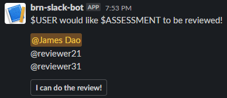

# Rough Workflow

1. User tells the github bot to that they want their assessment reviewed
2. Github bot tells CRUD app, which updates relevant databases
3. CRUD app sends a post request to the Slack webhook, which pings potential reviewers and provides a button to press if they want to be a reviewer
4. When a reviewer clicks the button, this tells the CRUD app to:
    - Update relevant databases
    - Update the original Slack message to remove the button and state who is the review for that assessment
    - Tell the github bot that a reviewer has been assigned

# Step 3

`review_request.json` is the template for the payload that gets sent to the Slack incoming webhook (ask @jmsdao if you need to know what it is!). The interactive elements were built with [Slack's block kit builder](https://app.slack.com/block-kit-builder).

When you send the payload to the webhook, a message will be posted in a Slack channel. It looks something like this:

## TODO
The CRUD app will need to send a post request to the Slack webhook after a user tells the github bot that they want theire assessment reviewed.

The CRUD app will need to edit the payload template (line 8 & 15) to include:
- Who is requesting the assessment review
- A link to the repo with the assessment
- 1 to 3 Slack user IDs to ping reviewers

# Step 4

When a reviewer in the Slack channel clicks `I can do the review!` and then clicks `OK!`, Slack will send a post request to one of the CRUD app's endpoints. The post request will have a bunch of information in JSON, but most importantly it has:
- The Slack ID of the reviewer who clicked the button: `"user": {"id": "Uxxxxxxxxxx", ...}`
- The response URL used to update the original Slack message: `"response_url": "https://hooks.slack.com/actions/blahblahblah"`

After a reviewer is assigned, we want to update the Slack message to remove the button. `review_request_update.json` is the template for the payload used to make the update, which needs to be sent to the response URL.

## TODO

First thing is to update the Slackbot's request URL to point to CRUD's endpoint. Right now, when a user clicks `I can do the review! -> OK!`, the post request gets sent to https://smee.io/vgy5BMklenTdqsEw. This can be changed by going to https://api.slack.com/apps/ and navigating to "Interactivity & Shortcuts" in the sidebar. (This is @jmsdao's job, once he is given the CRUD app's endpoint URL)

The CRUD app needs an endpoint to handle reviewers clicking the button to assign themselves. It needs to:
- Update the relevant databases with who is reviewing which assessment
- Send a post request to the response URL to update the Slack message to remove the button and display who is the reviewer for the assessment
- Send a message to the github bot to alert the user on github who their reviewer is
